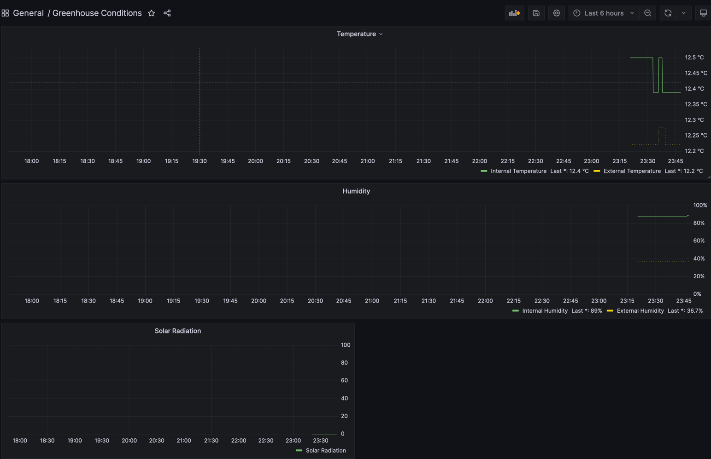

# ecowitt-data-prometheus-relay

Relay data from an Ecowitt weather station into Prometheus.

So you can produce fun little dashboards like the following:



## How it works

The Ecowitt gateway is configured to POST sensor data to `/data/report/` on this service every 60 seconds. The service parses the URL-encoded payload and registers each field as a Prometheus gauge under the `ecowitt_relay_` namespace, labelled by `model`, `stationType`, and `source_ip`.

A `GET /last` endpoint returns the verbatim body of the most recent station POST for debugging.

See [`docs/internal/ecowitt-protocol.md`](docs/internal/ecowitt-protocol.md) for the full protocol reference, field definitions, and a real sample payload.

## Configuration

```bash
ecowitt-data-prometheus-relay \
  --config /config.json \   # path to JSON config (currently unused, required)
  --debug \                 # verbose logging
  --ttl 5m                  # exit if no reports received for this duration (for pod restart)
```

## Releasing

CI runs vet/test/build on every push and PR. Docker images are published via [GoReleaser](https://goreleaser.com/) when a `v*` tag is pushed:

```bash
git tag v0.0.16
git push origin v0.0.16
```

GoReleaser creates a GitHub release, builds `linux/amd64` and `linux/arm64` binaries, and pushes a multi-arch Docker manifest to Docker Hub:

- `docker.io/astromechza/ecowitt-data-prometheus-relay:v0.0.16`
- `docker.io/astromechza/ecowitt-data-prometheus-relay:latest`

## Endpoints

| Path | Method | Description |
|---|---|---|
| `/data/report/` | POST | Ecowitt station upload target |
| `/metrics` | GET | Prometheus scrape endpoint |
| `/last` | GET | Verbatim body of most recent station POST |
